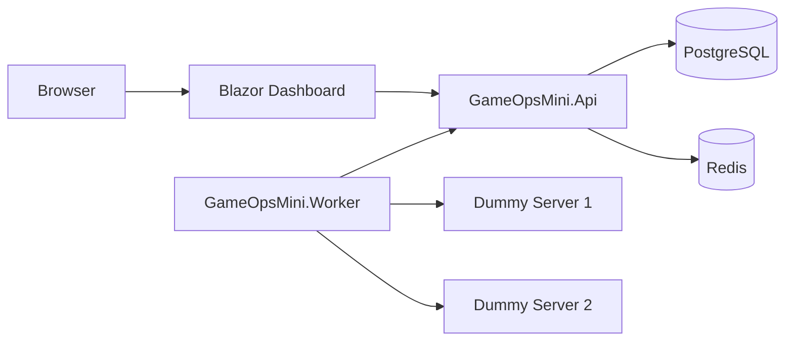

# GameOpsMini

## C#과 .NET을 기반으로 만든 소규모 서버 모니터링 프로젝트

API, Worker, Dashboard, Dummy TCP Server를 분리하고 PostgreSQL, Redis, Docker Compose, GitHub Actions를 함께 사용하여 서버 상태 감시와 자동 빌드 검증 흐름을 구성했습니다.

## 목차

1. 프로젝트 개요

2. 개발 목적

3. 주요 기능

4. 시스템 구성

5. 기술 스택

6. 실행 방법

7. API 목록

8. 장애 테스트 시나리오

9. 주요 문제 해결 사례

10. 프로젝트를 통해 배운 점

11. 한계 및 확장 방향

12. 프로젝트 결과 요약

13. 마무리

## 1. 프로젝트 개요

### 개요

GameOpsMini는 서버 운영 환경을 단순화해 구현한 서버 모니터링 프로젝트입니다.

감시 대상 서버의 TCP 포트 연결 가능 여부를 주기적으로 확인하고, 최신 상태는 Redis에 캐싱하며, 상태 변경 이력은 PostgreSQL에 저장합니다.

운영자는 Blazor Dashboard를 통해 각 서버의 현재 상태와 장애 이력을 확인할 수 있습니다.

이 프로젝트는 대규모 운영 환경을 직접 구현하기보다는, 서버 운영에 필요한 핵심 요소를 작은 규모로 재현하는 데 목적이 있습니다.

- 서버 상태 감시
- 상태 캐싱
- 상태 이력 저장
- 운영 Dashboard
- Docker 기반 실행 환경
- GitHub Actions 기반 CI

### 개발 기간

26.07.01 - 26.07.07(7일)

## 2. 개발 목적

이 프로젝트의 목적은 C#과 .NET을 이용해 서버 관리와 운영 자동화에 필요한 기본 역량을 보여주는 것입니다.

단순 CRUD 애플리케이션이 아니라, 실제 운영 환경에서 자주 다루는 다음 요소를 작은 규모로 구현했습니다.

- 백그라운드 Worker를 이용한 주기적 작업 처리
- TCP 포트 기반 서버 상태 확인
- Redis를 이용한 최신 상태 캐싱
- PostgreSQL을 이용한 상태 이력 저장
- Blazor를 이용한 운영 Dashboard 구성
- Docker Compose를 이용한 멀티 컨테이너 환경 구성
- GitHub Actions를 이용한 빌드 자동 검증

이를 통해 서버 프로그래머에게 필요한 비동기 처리, 외부 서비스 연동, 컨테이너 실행 환경 구성, CI 검증 흐름을 경험하는 것을 목표로 했습니다.

## 3. 주요 기능

### 서버 상태 감시

Worker Service가 감시 대상 서버 목록을 API에서 조회한 뒤, 각 서버의 TCP 포트 연결 가능 여부를 주기적으로 확인합니다.

### 최신 상태 캐싱

각 서버의 최신 상태는 Redis에 저장합니다.  
Dashboard와 API는 최신 상태를 빠르게 조회할 수 있습니다.

### 상태 이력 저장

서버 상태 점검 결과는 PostgreSQL에 이력으로 저장합니다.  
이를 통해 특정 서버가 언제 장애 상태가 되었고 언제 복구되었는지 확인할 수 있습니다.

### 운영 Dashboard

Blazor Dashboard에서 서버 목록, 현재 상태, 마지막 검사 시간, 실패 횟수, 상태 변경 이력을 확인할 수 있습니다.

### 장애·복구 테스트

Dummy TCP Server 컨테이너를 중지하거나 재시작하여 서버 장애와 복구 상황을 직접 테스트할 수 있습니다.

### CI 자동화

GitHub Actions를 통해 .NET Release 빌드와 Docker 이미지 빌드를 자동으로 검증합니다.

## 4. 시스템 구성



### 구성 요소

| 구성 요소               | 설명                                                              |
| ----------------------- | ----------------------------------------------------------------- |
| GameOpsMini.Api         | 서버 목록, 상태 갱신, 상태 이력 조회 API                          |
| GameOpsMini.Worker      | 주기적으로 감시 대상 서버의 TCP 포트를 확인하는 백그라운드 Worker |
| GameOpsMini.Dashboard   | 서버 상태를 확인하는 Blazor 기반 운영 Dashboard                   |
| GameOpsMini.DummyServer | 장애·복구 테스트를 위한 더미 TCP 서버                             |
| PostgreSQL              | 감시 대상 서버와 상태 이력 저장                                   |
| Redis                   | 서버별 최신 상태 캐싱                                             |
| Docker Compose          | 전체 서비스를 하나의 네트워크에서 실행                            |
| GitHub Actions          | 빌드 및 Docker 이미지 검증 자동화                                 |

## 5. 기술 스택

| 분류            | 기술                      |
| --------------- | ------------------------- |
| Language        | C#                        |
| Runtime         | .NET 10                   |
| API             | ASP.NET Core Minimal API  |
| Background Job  | .NET Worker Service       |
| Dashboard       | Blazor Interactive Server |
| Database        | PostgreSQL                |
| Cache           | Redis                     |
| Container       | Docker, Docker Compose    |
| CI              | GitHub Actions            |
| Version Control | Git, GitHub               |

## 6. 실행 방법

### 사전 준비

다음 프로그램이 설치되어 있어야 합니다.

- .NET 10 SDK
- Docker Desktop
- Git

### 저장소 클론

```bash
git clone https://github.com/Cho1Player/gameopsmini
cd GameOpsMini
```

### 전체 서비스 실행

```bash
docker compose up -d --build
```

실행 후 컨테이너 상태를 확인합니다.

```bash
docker compose ps
```

정상 실행 시 다음 서비스들이 실행됩니다.

```text
gameops-postgres
gameops-redis
gameops-api
gameops-worker
gameops-dashboard
gameops-dummy-server-1
gameops-dummy-server-2
```

### 접속 주소

| 항목             | URL                               |
| ---------------- | --------------------------------- |
| API Health Check | http://localhost:5000/health      |
| API Server 목록  | http://localhost:5000/api/servers |
| Dashboard        | http://localhost:5001/servers     |

### 서비스 종료

```bash
docker compose down
```

### 볼륨까지 삭제

PostgreSQL, Redis, Data Protection Key 등 저장 데이터까지 삭제하려면 다음 명령을 사용합니다.

```bash
docker compose down -v
```

주의: 이 명령을 실행하면 DB 데이터와 Redis 데이터가 함께 삭제됩니다.

---

## 7. API 목록

| Method | URL                         | 설명                            |
| ------ | --------------------------- | ------------------------------- |
| GET    | `/health`                   | API 상태 확인                   |
| GET    | `/api/servers`              | 감시 대상 서버 목록 조회        |
| GET    | `/api/servers/{id}`         | 특정 서버 상태 조회             |
| POST   | `/api/servers/{id}/status`  | 특정 서버의 상태 갱신           |
| GET    | `/api/servers/{id}/history` | 특정 서버의 상태 변경 이력 조회 |

### 서버 목록 조회

```http
GET /api/servers
```

응답 예시:

```json
[
  {
    "id": 1,
    "name": "DummyGameServer-1",
    "host": "dummy-server-1",
    "port": 7777,
    "state": 1,
    "lastCheckedAt": "2026-07-07T14:04:51Z",
    "failureCount": 0,
    "message": "TCP port is reachable"
  }
]
```

### 서버 상태 갱신

```http
POST /api/servers/1/status
Content-Type: application/json
```

```json
{
  "state": 1,
  "lastCheckedAt": "2026-07-07T14:04:51Z",
  "failureCount": 0,
  "message": "TCP port is reachable"
}
```

---

## 8. 장애 테스트 시나리오

이 프로젝트는 Dummy TCP Server 컨테이너를 직접 중지하거나 재시작하여 장애와 복구 상황을 테스트할 수 있습니다.

### 1. 전체 서비스 실행

```bash
docker compose up -d --build
```

Dashboard에 접속합니다.

```text
http://localhost:5001/servers
```

초기 상태에서는 두 서버가 모두 `UP`으로 표시됩니다.

```text
DummyGameServer-1 → UP
DummyGameServer-2 → UP
```

### 2. 서버 장애 발생

첫 번째 더미 서버를 중지합니다.

```bash
docker compose stop dummy-server-1
```

Worker가 다음 검사 주기에 TCP 연결 실패를 감지합니다.

Dashboard에서는 최대 약 10초 이내에 다음처럼 상태가 변경됩니다.

```text
DummyGameServer-1 → DOWN
DummyGameServer-2 → UP
```

### 3. 서버 복구

중지한 더미 서버를 다시 실행합니다.

```bash
docker compose start dummy-server-1
```

Worker가 TCP 연결 성공을 감지하면 Dashboard에서 상태가 다시 변경됩니다.

```text
DummyGameServer-1 → UP
```

### 4. 상태 이력 확인

Dashboard에서 `이력 보기` 버튼을 클릭하면 해당 서버의 상태 변경 이력을 확인할 수 있습니다.

```text
UP → DOWN → UP
```

이 과정을 통해 단순 화면 표시뿐 아니라 Worker, API, Redis, PostgreSQL, Dashboard가 함께 동작하는지 검증할 수 있습니다.

---

## 9. 주요 문제 해결 사례

### 1. Docker 내부 localhost 문제

#### 문제

Worker를 컨테이너로 실행한 뒤 더미 서버가 실행 중이어도 상태가 `DOWN`으로 표시되었습니다.

#### 원인

컨테이너 내부에서 `127.0.0.1`은 Windows 호스트나 다른 컨테이너가 아니라 현재 컨테이너 자신을 의미합니다.

#### 해결

감시 대상 서버의 Host 값을 Docker Compose 서비스 이름으로 변경했습니다.

```text
127.0.0.1 → dummy-server-1
127.0.0.1 → dummy-server-2
```

이후 Worker는 Docker 네트워크를 통해 더미 서버 컨테이너에 정상적으로 TCP 연결할 수 있었습니다.

---

### 2. Data Protection 키 유실 문제

#### 문제

Dashboard 컨테이너를 재생성한 뒤 다음 오류가 발생했습니다.

```text
The antiforgery token could not be decrypted.
The key was not found in the key ring.
```

#### 원인

ASP.NET Core Data Protection 키가 컨테이너 내부에만 저장되어 있었고, 컨테이너 재생성 시 기존 키가 사라졌습니다.

브라우저는 이전 키로 생성된 쿠키를 계속 전송했기 때문에 새 컨테이너에서 복호화할 수 없었습니다.

#### 해결

Dashboard에 Data Protection 키 저장 경로를 지정하고 Docker 볼륨으로 영속화했습니다.

```csharp
builder.Services.AddDataProtection()
    .PersistKeysToFileSystem(
        new DirectoryInfo("/root/.aspnet/DataProtection-Keys"))
    .SetApplicationName("GameOpsMini.Dashboard");
```

```yaml
volumes:
  - gameops-dashboard-keys:/root/.aspnet/DataProtection-Keys
```

---

### 3. Blazor Dashboard 자동 갱신 실패

#### 문제

Docker 환경에서 Dashboard 화면은 표시되었지만 자동 갱신과 일부 Interactive 기능이 동작하지 않았습니다.

브라우저 개발자 도구에서는 다음 파일이 `404 Not Found`로 확인되었습니다.

```text
/_framework/blazor.web.js
```

#### 원인

기존 Dashboard Dockerfile은 다음 구조였습니다.

```text
csproj만 먼저 COPY
→ dotnet restore
→ 나머지 소스 COPY
→ dotnet publish --no-restore
```

이 과정에서 Blazor 프레임워크 정적 자산이 최종 publish 결과에 정상적으로 포함되지 않았습니다.

#### 해결

Dashboard Dockerfile을 전체 소스를 복사한 뒤 `dotnet publish`가 restore까지 직접 수행하는 구조로 단순화했습니다.

```dockerfile
COPY . .

RUN dotnet publish \
    GameOpsMini.Dashboard/GameOpsMini.Dashboard.csproj \
    --configuration Release \
    --output /app/publish \
    /p:UseAppHost=false
```

수정 후 다음 요청이 정상 응답했습니다.

```text
/_framework/blazor.web.js → 200 OK
```

Blazor WebSocket 연결도 정상적으로 생성되었습니다.

```text
_blazor → 101 Switching Protocols
```

---

### 4. Blazor 타이머 갱신 후 화면 미반영

#### 문제

API 호출은 주기적으로 실행되었지만 Dashboard 화면의 서버 상태가 자동으로 바뀌지 않았습니다.

#### 원인

`PeriodicTimer`는 Blazor UI 이벤트가 아니므로 데이터 변경 후 화면 재렌더링이 자동으로 보장되지 않았습니다.

#### 해결

타이머에서 데이터를 다시 불러온 뒤 `StateHasChanged()`를 호출했습니다.

```csharp
await InvokeAsync(async () =>
{
    await LoadServersAsync();
    StateHasChanged();
});
```

이후 서버 상태와 마지막 갱신 시간이 5초마다 정상 반영되었습니다.

---

### 5. GitHub Actions Node.js 경고

#### 문제

CI는 성공했지만 다음 경고가 표시되었습니다.

```text
Node.js 20 is deprecated.
```

#### 원인

기존 GitHub Actions 공식 액션 버전이 Node.js 20 기반으로 실행되고 있었습니다.

```yaml
actions/checkout@v4
actions/setup-dotnet@v4
```

#### 해결

Node.js 24 기반 버전으로 업데이트했습니다.

```yaml
actions/checkout@v6
actions/setup-dotnet@v5
```

수정 후 CI가 경고 없이 완료되었습니다.

---

## 10. 프로젝트를 통해 배운 점

이 프로젝트를 통해 다음 역량을 기를 수 있었습니다.

### C# / .NET 서버 개발

- ASP.NET Core Minimal API 구성
- Worker Service 기반 백그라운드 작업 처리
- `async`, `await` 기반 비동기 처리
- TCP 포트 연결 확인 로직 구현
- 공통 모델 분리 및 프로젝트 참조 구성

### 서버 운영 관점의 설계

- 주기적인 서버 상태 감시
- 장애 감지 및 복구 확인
- 최신 상태와 이력 데이터 분리
- 운영 Dashboard 구성
- 서버 상태를 사람이 확인 가능한 형태로 시각화

### 데이터 저장소 활용

- PostgreSQL을 이용한 감시 대상 서버 및 상태 이력 저장
- Redis를 이용한 서버별 최신 상태 캐싱
- DB와 Cache의 역할 분리

### 컨테이너 기반 실행 환경

- 프로젝트별 Dockerfile 작성
- Multi-stage Build 구성
- ASP.NET Runtime과 .NET Runtime 구분
- Docker Compose 기반 멀티 컨테이너 구성
- Docker 네트워크를 이용한 서비스 간 통신
- Docker Volume을 이용한 데이터 영속화

### CI 자동화

- GitHub Actions Workflow 작성
- .NET Release 빌드 자동화
- Docker 이미지 빌드 검증
- 경고를 오류로 처리하는 빌드 정책 적용
- Pull Request 기반 병합 전 검증

### 문제 분석 및 해결

- 컨테이너 내부 네트워크 문제 분석
- Blazor Interactive Server 정적 자산 문제 분석
- Data Protection 키 유실 문제 해결
- Git Bash 경로 변환 문제 해결
- CI 실행 조건 및 액션 버전 문제 해결

---

## 11. 한계 및 확장 방향

### 현재 한계

이 프로젝트는 서버 운영 환경의 핵심 흐름을 작은 규모로 재현한 프로젝트입니다.  
따라서 실제 대규모 운영 환경과 비교하면 다음 한계가 있습니다.

- 인증 및 권한 관리가 없음
- 서버 등록, 수정, 삭제 기능이 제한적임
- 알림 기능이 없음
- 장애 기준이 TCP 포트 연결 여부에 한정됨
- Dashboard UI가 단순함
- 테스트 코드가 충분히 작성되어 있지 않음
- Kubernetes 환경까지 확장하지 않음
- 실제 클라우드 배포는 포함하지 않음

### 확장 방향

추후 다음 기능을 추가할 수 있습니다.

#### 서버 관리 기능

- Dashboard에서 감시 대상 서버 등록
- 서버 정보 수정 및 삭제
- 서버 그룹 관리
- 서버별 점검 주기 설정

#### 알림 기능

- 서버 장애 발생 시 Slack 알림
- 장애 복구 시 알림
- 일정 횟수 이상 실패 시 경고 발송

#### 모니터링 고도화

- TCP 연결 확인 외 HTTP Health Check 추가
- 응답 시간 측정
- 최근 장애 횟수 통계
- 서버별 가동률 계산

#### Dashboard 개선

- 상태 변경 이력 그래프 추가
- 서버 그룹별 필터링
- 장애 서버만 보기
- 자동 갱신 주기 설정

#### 테스트 강화

- API 단위 테스트
- Worker TCP 검사 로직 테스트
- Redis 캐시 테스트
- PostgreSQL Repository 테스트
- GitHub Actions에서 테스트 자동 실행

#### 배포 환경 확장

- Docker Compose에서 Kubernetes로 확장
- Helm Chart 작성
- Azure Container Apps 또는 AKS 배포
- Elastic APM 또는 OpenTelemetry 연동
- ELK Stack을 이용한 로그 수집

---

## 12. 프로젝트 결과 요약

최종적으로 다음 항목을 검증했습니다.

```text
- 전체 솔루션 Release 빌드 성공
- GitHub Actions .NET Build 성공
- GitHub Actions Docker Build 성공
- Docker Compose 전체 서비스 실행 성공
- API Health Check 성공
- Worker 서버 상태 감시 성공
- Redis 최신 상태 캐싱 성공
- PostgreSQL 상태 이력 저장 성공
- Dashboard 서버 상태 표시 성공
- Dashboard 5초 자동 갱신 성공
- DummyServer 장애 및 복구 테스트 성공
```

---

## 13. 마무리

GameOpsMini는 작은 규모의 개인 프로젝트이지만, 단순 CRUD가 아니라 서버 운영에 필요한 여러 요소를 함께 다룹니다.

서버 상태 감시, 상태 저장, 캐싱, 운영 Dashboard, 컨테이너 실행 환경, CI 자동화까지 연결하면서 실제 서버 관리 도구의 축소판을 구현했습니다.

이 프로젝트를 통해 C#과 .NET 기반 서버 개발뿐 아니라, 운영 환경을 고려한 구성과 문제 해결 과정을 함께 보여줄 수 있습니다.

## Contributor

### 최인용
